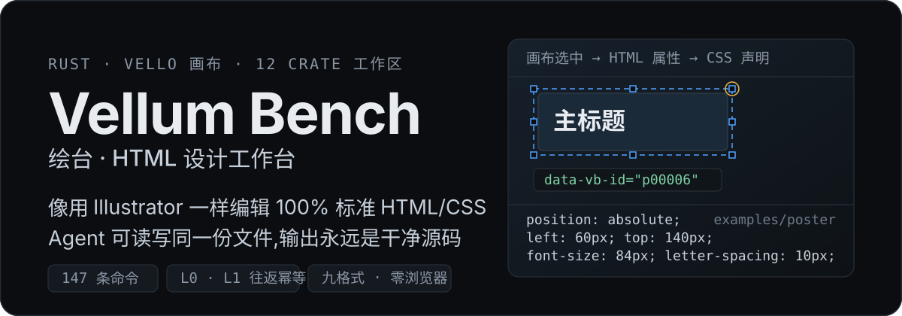
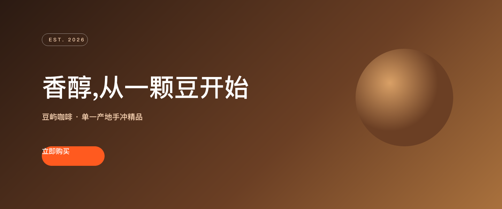
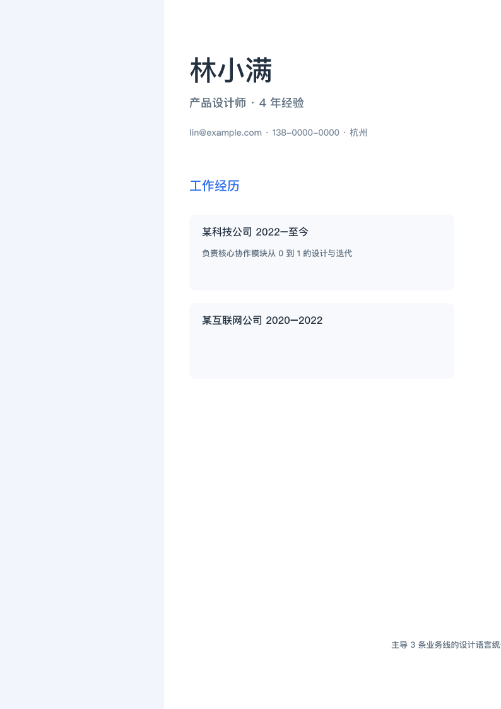
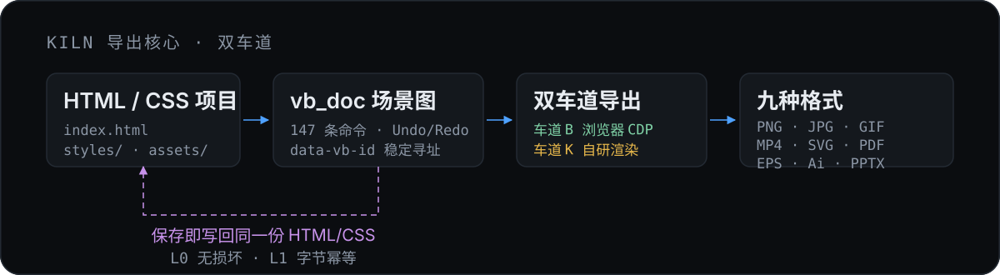

<p align="center">
  
</p>

<p align="center">
  <a href="https://github.com/GreenChennai/VellumBench/actions/workflows/ci.yml"></a>
  
  
</p>

<p align="center">
  <b>HTML 是文档格式,不是编译产物。</b><br>
  输出永远是干净、可读、可 diff 的 HTML/CSS —— 人和 Agent 都能接着改。
</p>

---

## 它是什么

一个桌面矢量设计工具,但**文档格式就是标准 HTML/CSS 项目目录**(`index.html` + `styles/` + `assets/`)。

你在画布上拖框、对锚点、调渐变,落盘的是`.vb-artboard`、`data-vb-id`、`position: absolute` 这些真实声明 —— 没有私有二进制格式,没有导出/导入往返损耗。内置导出核心 **Kiln** 一次产出 **PNG · JPG · GIF · MP4 · SVG · PDF · EPS · Ai · PPTX** 九种格式,并可反向导入 HTML / PDF / AI / SVG。

**把它接进 Agent 工作流**:Agent 出草稿 → 人类像画矢量图一样精修 → 存回同一份 HTML → Agent 继续迭代。这个循环没有终点,也不会锁死在任何一方的格式里。

---

## 真实产物(本仓库的示例稿件,由 Kiln 自己渲染)

<p align="center">
  
</p>

<table>
<tr>
<td width="50%"></td>
<td width="50%"></td>
</tr>
<tr>
<td><sub><code>examples/poster</code> · 750×1334 · 渐变 / 圆角 / 中文真字形</sub></td>
<td><sub><code>examples/resume</code> · 794×1123 · 文档流排版</sub></td>
</tr>
</table>

复现方式(不依赖浏览器):

```bash
kiln-cli export --source examples/landing --output landing.png --format PNG --engine native
```

### 机器评的保真度 —— 分数由夹具生成,不手写

最近一次归档报告([`bench/acceptance/`](bench/acceptance/) · 2026-09-19 · git `93ecf8d` · 浏览器车道):

| 门 | 指标 | 结果 |
|---|---|---|
| **G1** | PNG vs 系统浏览器基线(像素) | 平均 **99.80** / 最差 **99.65**,产物尺寸与基线**严格相等** |
| **G2 / G3** | PDF / AI vs PNG(可编辑性代价) | 平均 **99.36** |
| **G4** | 文本层可提取(CID + ToUnicode) | 通过 |
| **G5** | 字体嵌入 | **100%** |

> 诚实口径:历史 98.63 是「Kiln PDF→pdfium vs Kiln 自家 PNG」的**自洽分**(闭环、无浏览器真值),不作为对外分数;现行门禁一律以**系统浏览器渲染**为基线。别按「已完成」读的边界见下文[能力清单](#能力清单以代码为唯一真相)。

---

## 为什么不一样(三条不可妥协的原则)

1. **HTML 是文档格式,不是编译产物** —— 保存即写回 canonical HTML/CSS:`L0` 不损坏(打开别人的工程再存回不丢东西)、`L1` 字节幂等(第二次保存与第一次逐字节相同)。
2. **Illustrator 心智不可妥协** —— 快捷键、修饰键、术语零学习成本:8 手柄缩放、角外圈旋转、智能参考线、`Mod+D` 再次变换、对齐到「关键对象」、外观多条目……
3. **Agent 是一等公民** —— 用户能做的 Agent 都能做:147 条命令 + 无头 CLI(12 子命令 / `patch` 17 种 op)+ MCP Server;每个元素有稳定编号 `data-vb-id`,改名/移动/重排都不变。

---

## 怎么工作

<p align="center">
  
</p>

- **双车道导出(ADR-0020 / ADR-0022)**:`--engine auto` 默认在浏览器可用时走**车道 B** —— Rust 原生 CDP(手写 WebSocket/HTTP,零新依赖)驱动系统 Edge/Chrome,PNG 整页截图、PDF/AI 走 printToPDF;浏览器缺席时自动降级到**车道 K**(自研布局 + 光栅/矢量写入)并给出告警。
- **车道 K 也能独立交付**:真文本 SVG、CID 中文真文本 PDF(Type0/CIDFontType2 子集 + ToUnicode,阅读器可复制、Illustrator 可改字)、OCG 图层、clip-path、渐变栅格化 + SMask。
- **动画**:`@keyframes` 导出期解析,GIF/MP4 主路为逐帧实时采样(墙钟重采样);无浏览器时静态求值兜底。
- **`.ai` 边界**:PGF 无公开规范,`.ai` = PDF 兼容流 + AI9 头(Illustrator 可开、可改字、矢量保留,无原生图层面板),详见[可编辑性检查表](docs/ai-editability-checklist.md)。

---

## 上手

```bash
cargo build --release

# 1) GUI:Vulkan(wgpu)+ Vello 画布;无独显自动回退
target/release/vellumbench.exe

# 2) Kiln 无头导出(可单独分发给下游项目)
target/release/kiln-cli.exe export --source examples/poster --output poster.pdf --scale 2

# 3) Agent/CI:读写同一份文档
target/release/vellum-cli.exe --doc examples/landing/index.html tree --json
target/release/vellum-cli.exe --doc examples/landing/index.html patch ops.json
target/release/vellum-cli.exe --doc examples/landing/index.html validate --json   # L0/L1 门
```

`vellum-cli` 的 `patch` 是事务性的(`base_rev` 乐观锁,全部成功或全部回滚),op 覆盖 `set_text` / `set_style` / `set_box` / `group` / `align` / `boolean` / `set_token` 等 17 种。

质量门禁一条命令,本地与 CI 同源:

```bash
pwsh tools/ci.ps1     # 格式 · clippy -D warnings · 全量测试 · Agent 自检 · 术语扫描 · 输出校验 · 硬编码颜色棘轮 · 三端一致性
```

---

## 能力清单(以代码为唯一真相)

> 完整清单(**能力 / 状态 / 命令 ID / Agent 可否复现**)见 [`crates/vb_app/src/capabilities.rs`](crates/vb_app/src/capabilities.rs) —— 应用内「**帮助 → 能力台账…**」可直接查看,并由门禁测试逐条校验「台账里列出的命令必须已注册」。下表只是摘要。

### 已落地

| 模块 | 状态 |
|---|---|
| 12 crate workspace,依赖方向受控;`vb_doc` 场景图 + 命令模式 Undo/Redo(sid 寻址) | ✅ |
| `vb_css` L1 白名单属性表 + 值规范化(canonical 即不动点);`vb_html` 忠实解析 + canonical 序列化 | ✅ |
| **`vb_layout` 文档流布局**(taffy:flow/flex/absolute、`inset`/`margin`/`padding`、`var()`/`calc()`、`transform: translate()` 折算) | ✅ |
| **文本引擎**:富文本段样式、`<br>`、贪心断行 + 禁则、字重感知选字、`@font-face` 注册表、真字形光栅 | ✅ |
| **GUI**:Vulkan + Vello 画布、8 手柄缩放 / 角外圈旋转、智能参考线、Alt 复制、框选(相交即选) | ✅ |
| **面板体系**:属性(七分组)/ 图层 / 画板 / 令牌 / 字符 / 段落 / 外观(多条目)/ 描边 / **渐变(可拖动色标条)** / 透明度 / 颜色 / 变换 / 对齐 | ✅ |
| **顶部菜单** AI 规范 9 项;工具箱四向停靠 + `workspace.json` 持久化;命令面板 `Ctrl+K` | ✅ |
| **文件监听热重载**(Agent 改 HTML → 画布更新) | ✅ |
| **外部格式导入**:`kiln-cli import` —— PDF/AI(pdfium,文本可编辑)、SVG(usvg 纯 Rust,逐对象映射);`kiln-cli img` 位图工具箱(crop / trim-border / stitch / blur / pad / info) | ✅ |
| **往返语料库 22 例**(L0 无损坏 / L1 字节幂等)+ 全量测试 **435 用例** | ✅ |
| 147 条命令 / 76 键位绑定(注册表 ↔ `commands.yaml` 门禁锁定);`vellum-mcp` 10 工具 | ✅ |

### 未落地 ⏳ —— 别按「已完成」读

| 缺口 | 现状(代码实测) | 计划 |
|---|---|---|
| 画布真文本 | CPU 导出真字形已落地;画布仍 egui 近似([ADR-0017](docs/adr/0017-canvas-text-approximation-v01.md)),Parley 多行/双向留后续 | 复议中 |
| 路径查找器 | 四基本运算 + 合并 / 减去后方对象 / 裁剪;**分割 / 修边 / 轮廓**需「一条命令产出多节点」 | v2 |
| 响应式断点 / 伪类编辑 | 伪类规则**导入保真**;编辑器内的断点与伪类编辑未开始 | v2 |
| 蒙版 / 切片 / 图像置入 | 不透明度蒙版(`mask-image`)已落地;剪切蒙版、`data-vb-slice`、置入替换 | v2 |
| SVG / PDF 导入边界 | 自由曲线以包围盒近似 + 警告;渐变取中点色;`filter`/`mask`/`clipPath` 跳过(逐版补,不静默) | 逐版补 |
| 组件 / 时间轴 / CRDT | 未开始 | 不承诺档期 |

---

## 文档(灵魂,先读)

| 文档 | 内容 |
|---|---|
| [docs/design/00](docs/design/00-需求拷问与产品定义.md) | 为什么存在、做什么、不做什么 |
| [docs/design/01](docs/design/01-核心概念与AI术语对照.md) | Illustrator 概念 ↔ HTML 对照 |
| [docs/design/04](docs/design/04-文档模型与HTML序列化.md) | 场景图与序列化 |
| [crates/vb_kiln/docs/README.md](crates/vb_kiln/docs/README.md) | Kiln 导出核心架构 |
| [CONTEXT.md](CONTEXT.md) | 术语表(单一真相) |
| [docs/adr/](docs/adr/) | 架构决策记录 |

---

## License

**ACL-1.0** —— Artboard 社区开源协议(与 Artboard 共用同一份协议文本):

- **允许**:自由使用、学习、修改、分发,含**商业性内部使用**;用它做出来的**产出物归你** —— 可商用、可闭源、**无开源义务、无署名义务**。
- **传染**:再分发本软件(整体或实质部分,含打包分发、SaaS/API 形态)必须**整体以 ACL-1.0 开源**,并随附完整对应源码与本协议文本。
- **禁止**:把**软件本体**当作商品单独出售、出租或订阅。安装部署、定制开发、培训咨询,以及**销售产出物**,都不在此限。

完整条款见 [LICENSE](LICENSE)(中文版为准)。仓库内引用的第三方素材(依赖库、字体等)保持各自原有授权,详见 [docs/deps.md](docs/deps.md)。
